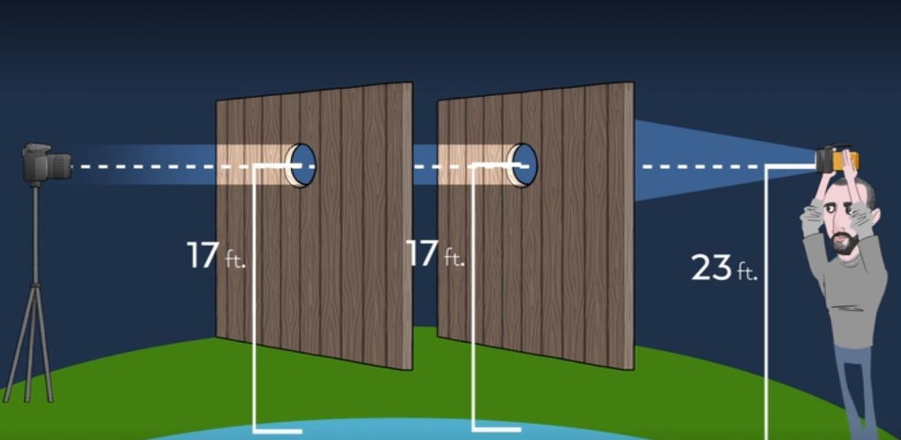

+++
title = "Das Dilemma der Unwissenheit - Wie Kritisches Denken zwischen Wahr und Falsch entscheidet"
date = "2023-12-17"
draft = false
pinned = false
image = "true-or-false-questions.jpg"
+++
In unserem Alltag sind wir oftmals mit der Frage konfrontiert, welche Aussage wirklich der Wahrheit entspricht. Doch häufig ist es uns nicht möglich, die absolute Wahrheit zu finden. Dies führt zu einem alltäglichen Dilemma der Ungewissheit.

Eine Möglichkeit diesem Unwissen entgegenzutreten, ist der skeptische Ausweg. Dieser schlägt vor, dass jede Wahrheit relativ ist und von individuellen Perspektiven abhängt. Diese Position birgt jedoch die Gefahr, dass sie zu einem intellektuellen Stillstand führt, da sie die Existenz einer objektiven Realität verneint. Ein solches Denken könnte dazu führen, dass Menschen ihre Überzeugungen nicht mehr in Frage stellen und jede Meinung als gleichwertig akzeptieren, unabhängig von der Stärke ihrer Begründung oder Evidenz.

Auf der anderen Seite bedeutet der dogmatische Ausweg, dass man sich bedingungslos einer Autorität unterwirft und auf deren Urteil vertraut. Dabei geht man davon aus, dass diese Autorität über das nötige Wissen verfügt, um zwischen wahr und falsch unterscheiden zu können.

Es ist ziemlich offensichtlich, beide Auswege haben nicht viel mit kritischem Denken gemeinsam. Kritisches Denken selbst ist ein Ansatz, der darauf abzielt, dass Wissen nicht zwangsläufig absolut sein muss, sondern in Form von gut begründeten Aussagen vorliegen kann. Eine solche Aussage setzt sich in der Regel aus Prämissen, Konklusion und einer schlüssigen Verbindung zwischen beiden zusammen. Die Herausforderung besteht darin, logisch von der Prämisse zur Konklusion zu führen, wobei besonderes Augenmerk auf die Ausführung der Verbindung gelegt werden sollte. Dabei ist es von entscheidender Bedeutung, kognitive Fehlschlüsse zu vermeiden und falsche Prämissen zu erkennen, da selbst ein scheinbar logisch geschlossenes Argument falsch sein kann, wenn es auf fehlerhaften Annahmen beruht. Das kritische Denken erfordert somit ein Bewusstsein für die eigenen Denkprozesse und eine Fähigkeit zur Selbstreflexion, um die Qualität der eigenen Argumentation ständig zu verbessern.

In der Konstruktion von kritischem Wissen spielt die Fähigkeit, überzeugende Argumente zu formulieren, eine zentrale Rolle. Es geht darum, eine Position nicht nur zu vertreten, sondern sie auch verständlich und überzeugend zu kommunizieren. Dies erfordert nicht nur logische Klarheit, sondern auch die Fähigkeit, komplexe Ideen in verständliche Begriffe zu übersetzen.

Es ist jedoch wichtig zu erkennen, dass Argumente nicht immer eindeutig sind und kollidieren können. Dabei erscheinen beide Argumente in allen drei Aspekten – Prämisse, Verbindung und Konklusion – als richtig, schliessen sich gegenseitig aber aus. Der Dialog ermöglicht es, unterschiedliche Perspektiven zu verstehen, Schwächen in den Argumenten zu identifizieren und gegebenenfalls zu einer Synthese zu gelangen. Eine gute Strategie ist es ebenfalls, die Perspektive zu wechseln. Oder man geht einmal grundsätzlich davon aus, dass die andere Aussage richtig ist, und analysiert, was daraus folgt. Führt die Wahrheit der Aussage zu Probleme oder einer Kontradiktion? Oder macht es vielleicht doch Sinn, sie als wahr zu betrachten. Das gleiche kann natürlich auch auf die eigene Aussage angewandt werden.

Was dabei aber nicht passieren darf ist, dass man Anstelle der Widerlegung der eigenen Überzeugung, auf die Unwahrheit einer vorausgesetzten Wahrheit schliesst. Als Beispiel dazu: ein Experiment eines Flatearthers. Dabei ging es darum, ein für alle Mal zu beweisen, dass die Erde flach ist. Wie zu erwarten, sprach das Resultat klar für eine gekrümmte Erdoberfläche. Doch anstatt das Resultat zu akzeptieren, wurde das Experiment von dem Flatearther selbst, als fehlerhaft bestimmt. Dies ist ein Paradebeispiel für die Gefahr von selektiver Wahrnehmung. Dieser Flatearther hat die Fähigkeit verloren, kritisch zu denken.

*Das Laser Experiment aus der Dokumentation 'Behind the Curve'*

Insgesamt zeigt sich, dass kritisches Denken nicht nur eine Fähigkeit ist, sondern eine Haltung gegenüber Wissen und Erkenntnis. Es erfordert die Bereitschaft, sich in komplexe Fragen zu vertiefen, die eigenen Überzeugungen zu hinterfragen und die Vielschichtigkeit von Argumenten zu erkennen. Der Weg des kritischen Denkens mag anspruchsvoll sein, aber er führt zu einer tieferen und nuancierteren Verständnisweise der Welt um uns herum.